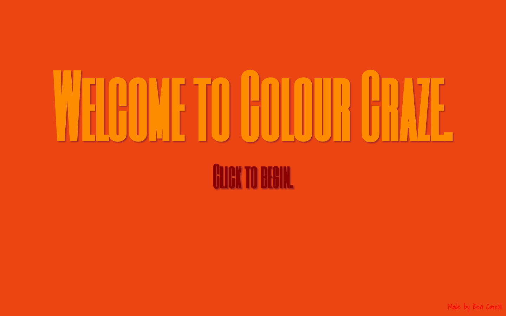

# **Colour Craze!** #


Welcome to Colour Craze, the super-awesome colour-changing game!


### How does it work? ###

* In each Colour Craze round, you will have to click on the Current Colour before your time runs out, or you will lose a point.
* Colour Craze runs in a Web Browser, and it is made with the help of HTML, CSS and of course, Javascript!

### How do I play? ###

* You can play version 1.0 of Colour Craze at [www.colourcraze.tk](www.colourcraze.tk).
    * This will be updated to version 2.0 very soon.
* Also, the source code will soon be available for download.

### What is it made with? ###

* Colour Craze uses native JavaScript, but also a teeny tiny bit of jQuery, for the cool colour-changing background a few pages.
* Within the JavaScript, it uses a few of the following:

```javascript
// Changing the background colour of the elements
for (var e = document.querySelectorAll('#middle'), n = 0; n < e.length; n++) {
    e[n].style.backgroundColor = currentColour
}
// More source code will be released later...
```

#### Thanks for checking it out! Head over to [www.colourcraze.tk](www.colourcraze.tk) to play now! ####
